# _[B2B LE Product Video Player]_

#### _Jazz up your product detail pages by adding videos!_

#### This component lets you associate YouTube and/or externally hosted videos to your products. Display your videos in an accordion or tabular format.

If a picture is worth a thousand words, a video is definitely worth a lot of pictures! The B2B LE Video Player component enables you to associate videos with your products and display them in the store’s product detail page.

<h4 align="center">
	<a href="#features">Features</a> |
	<a href="#getting-started">Getting Started</a> |
	<a href="#configuration">Configuration</a> |
	<a href="#usage">Usage</a> |
	<a href="#internationalization">Internationalization</a> |
	<a href="#faqs">FAQs</a> |
	<a href="#documentation">Documentation</a> |
	<a href="#contributing">Contributing</a> |
	<a href="#acknowledgements">Acknowledgements</a> 🥰
</h4>

<p align="center">
	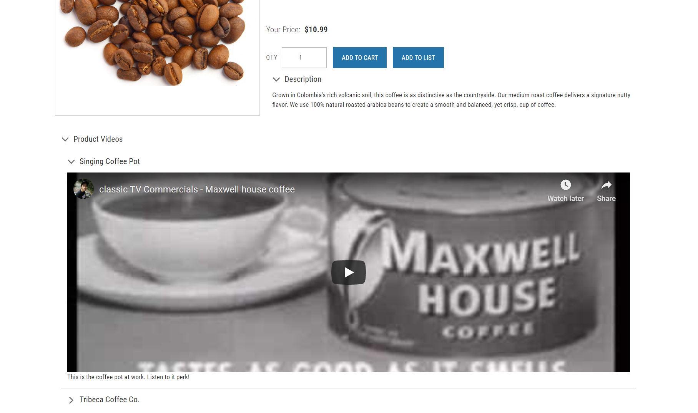
</p>

---

## Features

- **multi-source** Display either YouTube or externally hosted videos
- **display options** Display videos in an accordion or tabular format
- **internationalized** Provide translations for your video titles and descriptions

## Getting Started

### Prerequisites

There are a few items you need to setup before installing:

1. You will need to [Enable Lightning Experience](https://trailhead.salesforce.com/en/content/learn/modules/lex_migration_introduction/lex_migration_introduction_administration).
2. You will need to [Enable My Domain](https://trailhead.salesforce.com/en/content/learn/modules/identity_login/identity_login_my_domain).

### Install

Deploy the source:

1. Clone this repository:

```
git clone git@github.com:sfdc-qbranch/B2B-LE-Product-Video-Player.git
cd B2B-LE-Product-Video-Player
```

2. Authorize with your org and provide it with an alias (OrgAlias):

```
sfdx force:auth:web:login -a "OrgAlias"
```

3. Push the app to your org:

```
sfdx force:source:deploy --sourcepath force-app/main/default --json --loglevel fatal --targetusername "OrgAlias"
```

4. Open the default org:

```
sfdx force:org:open --targetusername "OrgAlias"
```

## Configuration

### Security Updates

Profile: Customer Community Plus

	Make the following changes to the profile, or include in a permission set:

		Object & FLS changes

      		Product Video
      		Product Video I18N

				Grant Read access to all fields

		Enable access to these Apex Class Access:

    		ProductVideoController

Profile: System Administration

	Make the following changes to the profile, or include in a permission set:

		Object & FLS changes

			Product Video
      		Product Video I18N

				Grant Read/Write access to all fields

### Page Layout changes

Update the Product page layout to include the Product Videos related list:

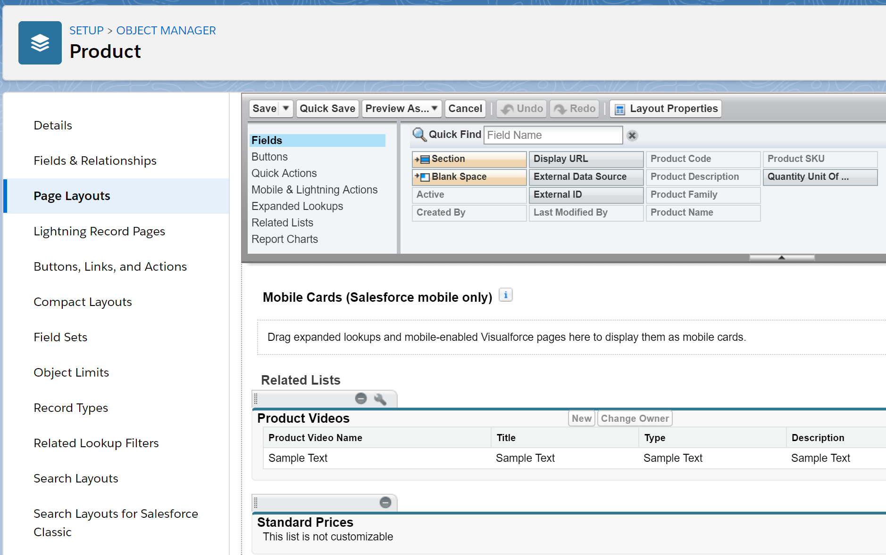

<br/>
<br/>

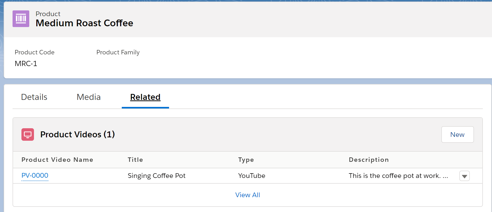

### Picklist Value Sets

The B2B Product Video **Locales** picklist value set is used by the **Language** picklist field in the **Product Video** and **Product Video I18N** objects:

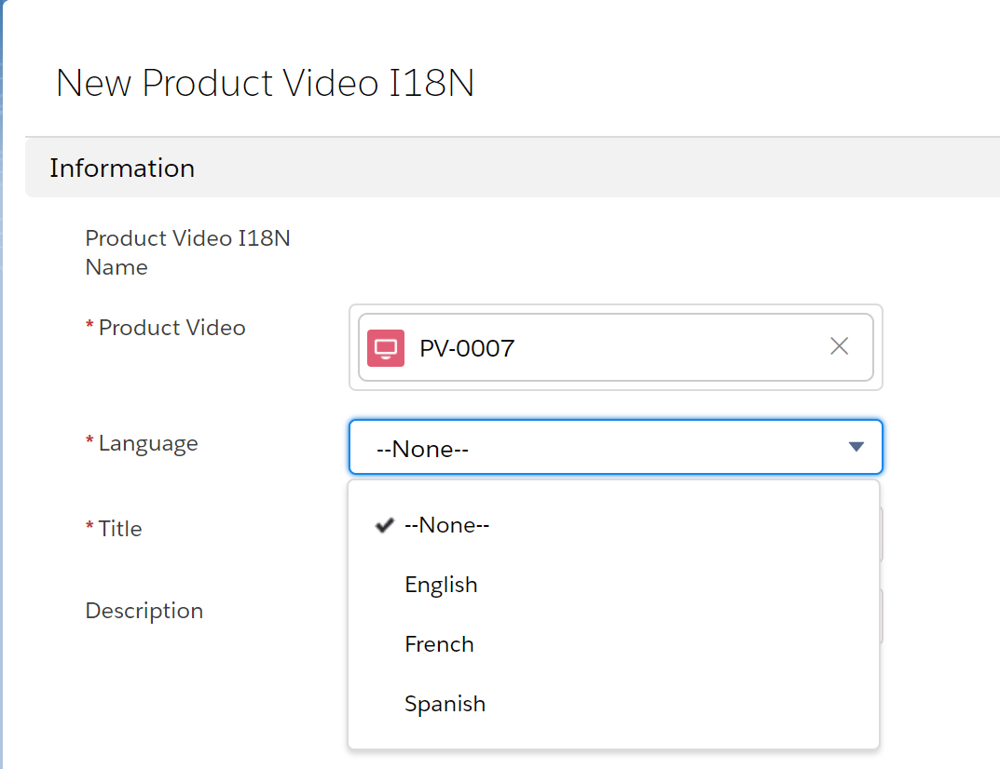

Update the **B2B Product Video Locales** picklist value set to include any additional languages and locales needed for your store users.

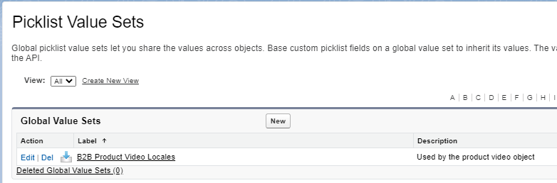

When adding a new **locale**, the **Value** must be the **display version** of the language (ex: Spanish), and the **API Name** must be the **locale code** (ex: es):

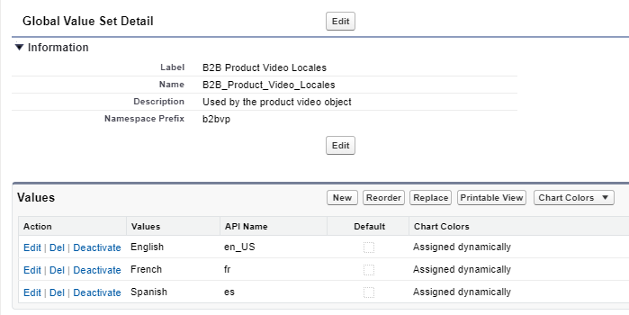

Click **[New]**.  Enter the **display version** of the locale in the Add Picklist Values box:

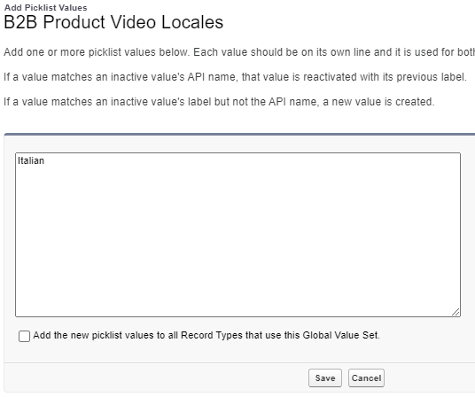

After saving the new value(s), edit them and change the **API Name** to the **location code**:

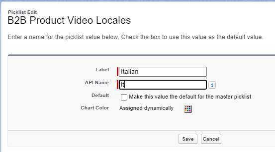

## Usage

### Add the component to your store

After installing the video player component, open your store’s community in **Experience Builder**.

Click the drop-down to the right of the **Home** page.

Expand **Product**, then click on **Product Detail**:

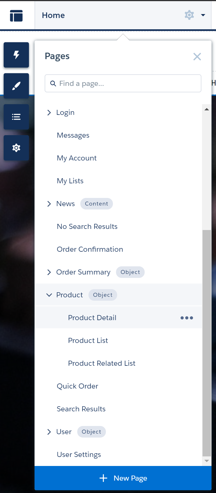

In the **Product Detail** page, click on the **Components** button.  Scroll the list down until you see **Custom Components**


Drag the **B2B Product Video Display** component onto the page layout

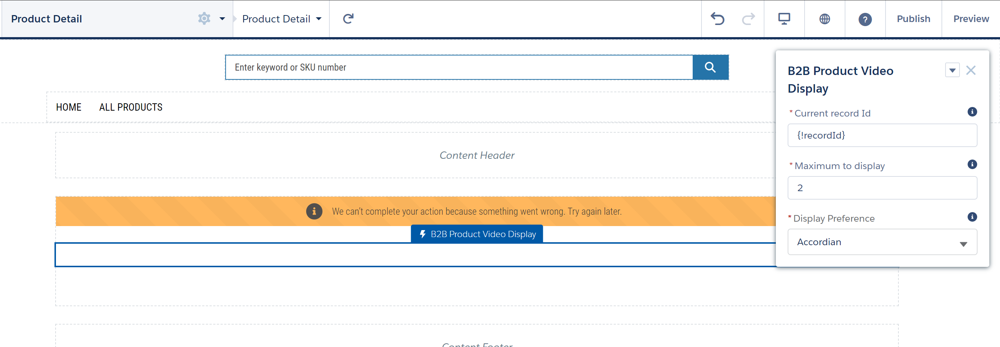

Click **Publish** to save your changes.

### Supported Configuration Options

The component comes with several properties you can use to control how the component functions.

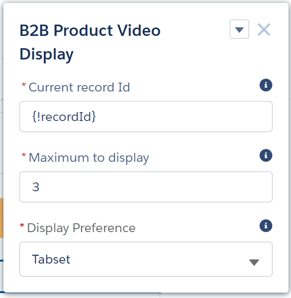

**Current record Id:** expression used to tell the component the Id of the underlying product.  Changing this value is not recommended.

**Maximum to display:** this property is used to tell the component how many videos to display.  You can set a minimum of 1 and a maximum of 5.

**Display Preference:**  You can choose Accordion or Tabset.

Be sure to click **[Publish]** to save any property changes you make.

### Create a Product Video Record

I’ll add a Product Video to an existing Product.  For this existing Product record, start by clicking on the **Related** tab.

As you can see, a Product Video record has already been created for this Product.  For the new **Product Video** record I’ll create, I’ll set it up to display after the existing video.


Click **[New]** to create a **Product Video** record.

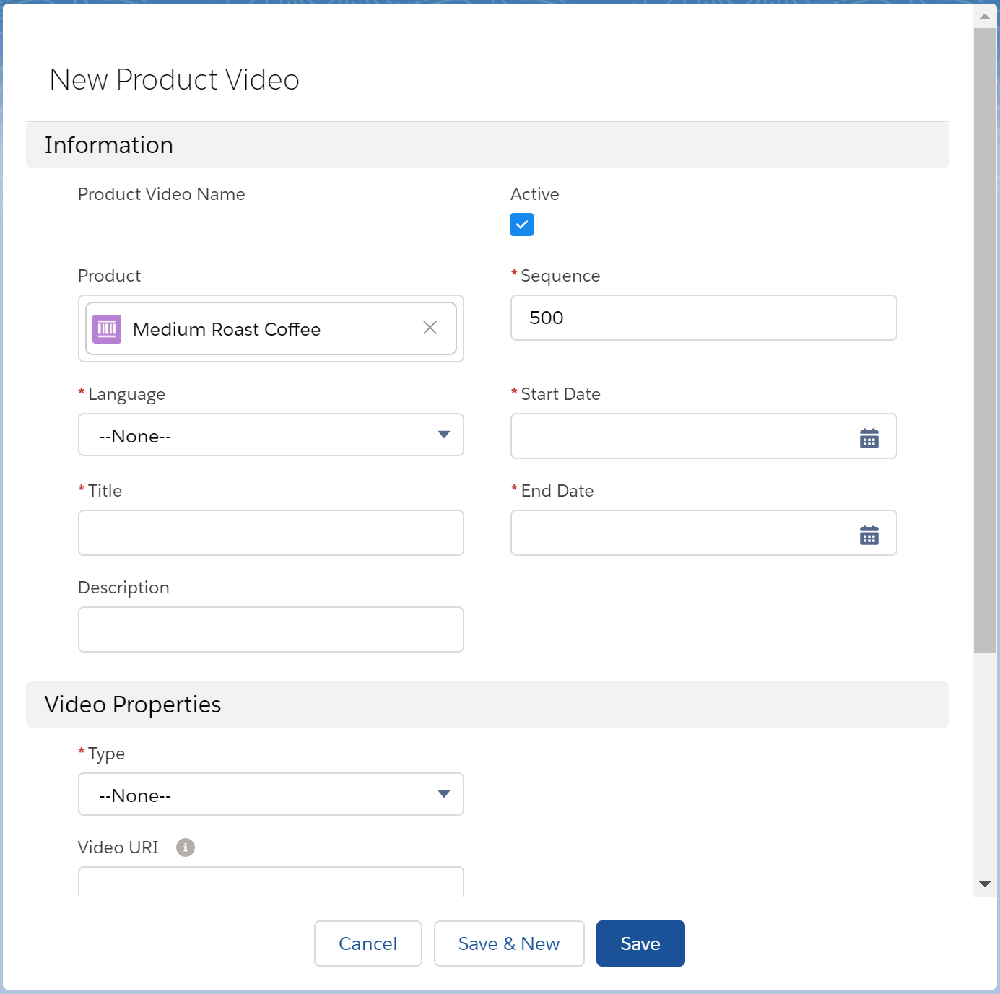

I’m required to select the **Language**, so I’ll pick English

I’ll enter a **Title**.

A **Description** is optional.  If you enter something, it will be displayed underneath the video.

The **Sequence** defaults to **500**, let’s change that to 200, so that this video will be displayed after the existing one.

For the **Start Date**, I recommend using a date prior to today.

For the **End Date**, if your video will never expire, enter a date far out into the future, like 12/31/2099.

For **Type**, choose **YouTube** for a YouTube video and enter the video Id in the **YouTube Video Id** field:


Be very careful to enter the video ID exactly.  In this example, the Id actually has a hyphen at the beginning.

I’ll go ahead and **[Save]** the new record.

There are now two videos associated with the current product:

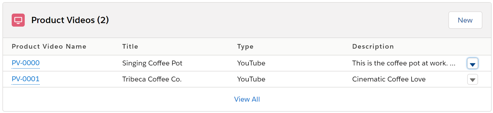

When I refresh the detail page for that product in the store, the video player component displays the videos in an accordion layout by default.  I’ll show you how you can change that later.

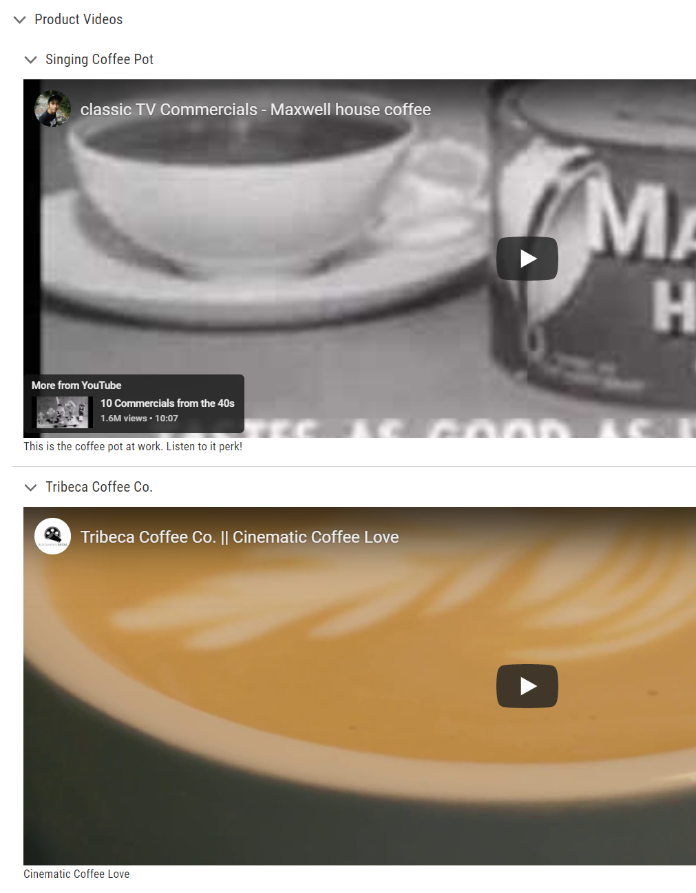

I see that the two videos are displayed in the correct order.

The **Title** appears above the video, and the **Description** is displayed underneath.


### Changing the Display Options of the Component

The video player component comes with several configuration options that enable you to control how videos are displayed in the store.  I’ll show you how to update them within **Experience Builder**.

In the store’s community, I’ve opened the **Product Detail** page.  When I click on the **B2B LE Video Player** component in the layout, the configuration options are shown:

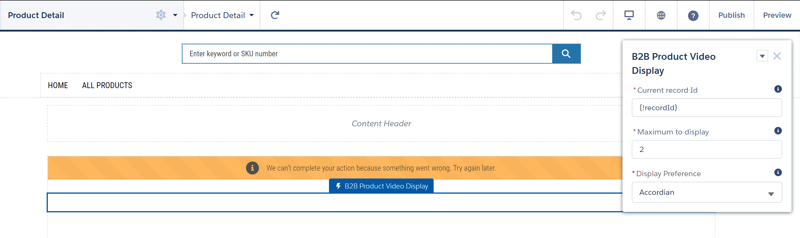

I’ll change the **Maximum to display** value from 2 to 3.

I’ll also change the **Display Preference** from **Accordion** to **Tabset**:


I’ll publish my changes.

When I go back to the store and refresh the product detail page, the product videos now display as a series of tabs:

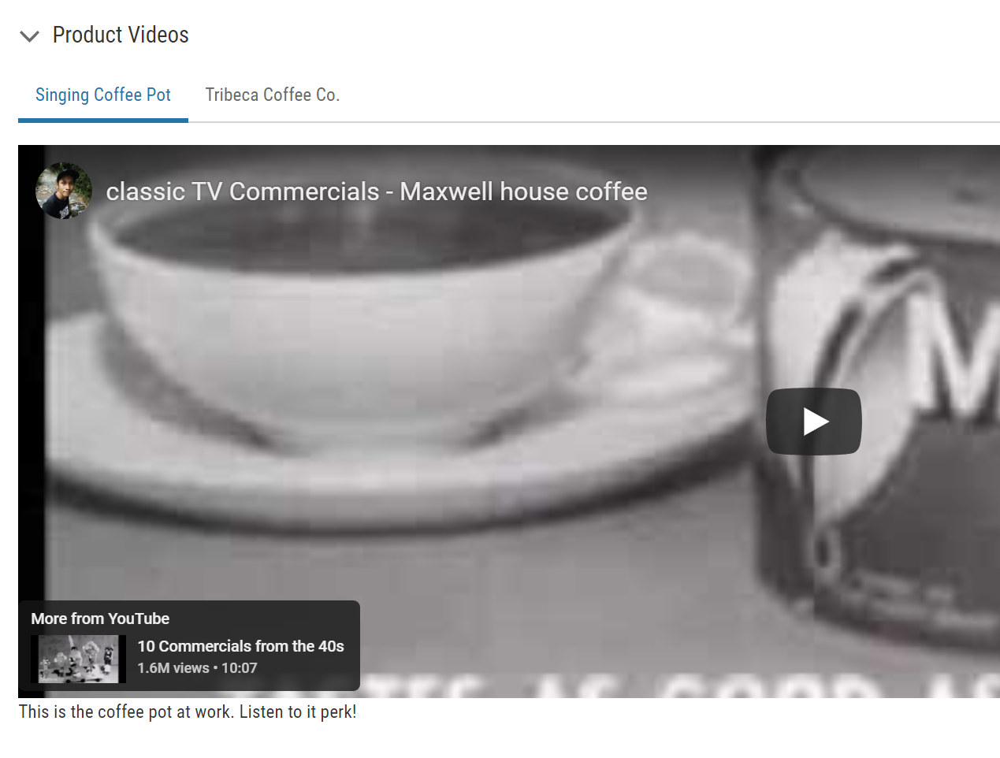

### Using Hosted Resources

The product video component also enables you to include videos hosted on an external server.

In order for the video to play within the store, you need to create a **CSP Trusted Site** record for the domain where the video resides.

I’ve already created the record for the video I want to show in the store.  The domain is for an Amazon cloud server:


I’ll go ahead and create a new **Product Video** record for this resource.

I’ll select **English** as the **Language**.

I’ll give it a **Title** of “Folgers”, and a **Description** of “Bad Tasting Coffee?”

I’ll change the **Sequence** to 300.

I’ll enter a valid **Start** and **End Date**.

For the **Type**, I’ll select **MP4**.

I’ll enter the URL for the hosted video into the **Video URI** field:

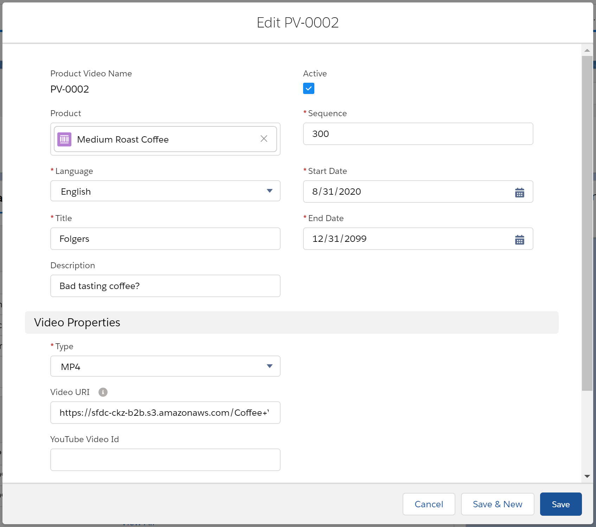

In the store, when I refresh the product detail page, I see the hosted video is rendered and will play:

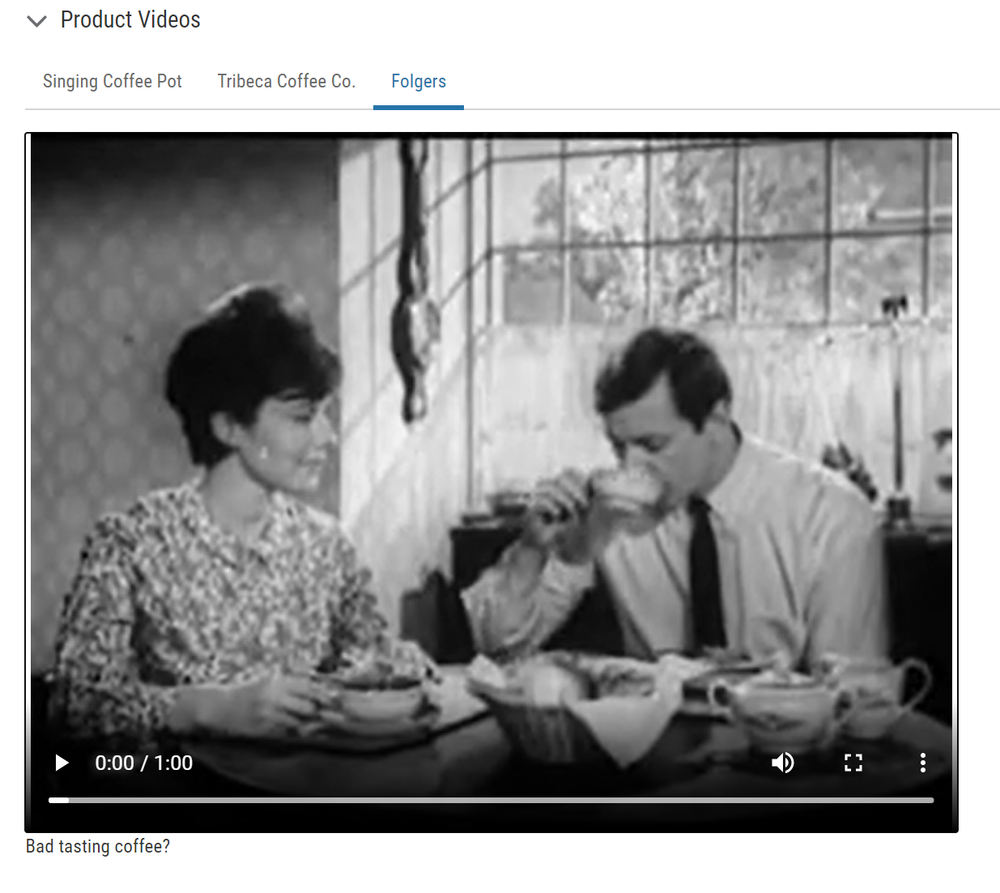

---

## Internationalization ##

### Adding Translations ###

The video player component fully supports internationalization.  The package you installed includes a new custom object called **Product Video I18N (a.k.a. the translation record)**.  You create a translation record from a Product Video record when you want to display the video’s **Title** and **Description** in the user’s local language.

To create a translation record, open an existing Product Video record.

Scroll down so that you can see the **Product Video I18Ns** related list:

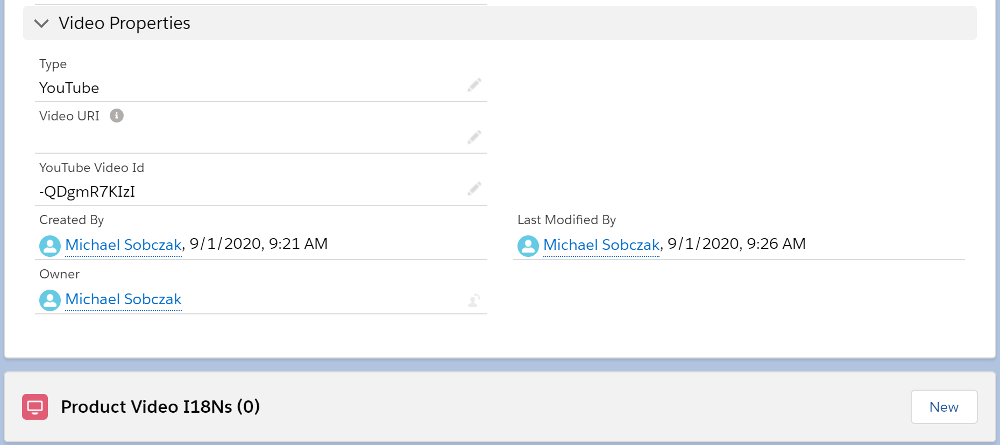

Click **[New]**

The **Language** field is required, so I’ll select **Spanish**.

**Title** is also required.  In this case, there is no Spanish translation for the video’s Title, so I’ll enter the English value for that field.

For the **Description**, there is a Spanish equivalent, so I’ll paste the translation into that field.

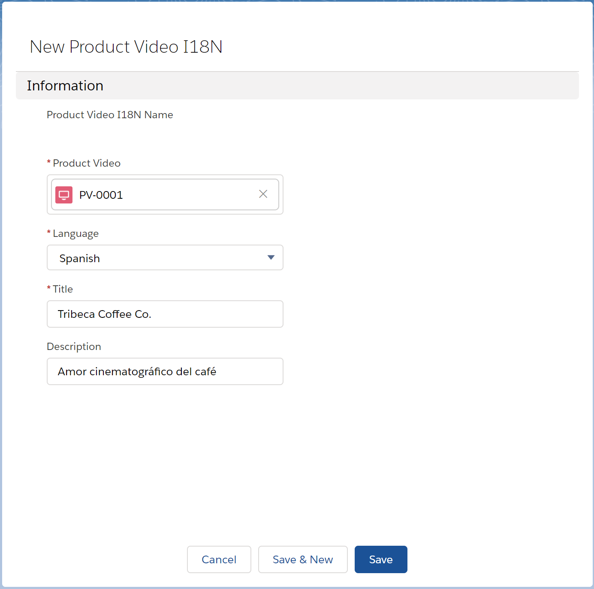

I’ll go ahead and click **[Save]**.
 
I’ve logged into the Store as a user whose language is **Spanish**.  When I refresh the detail page for that product, I now see the **Description** displayed in Spanish:

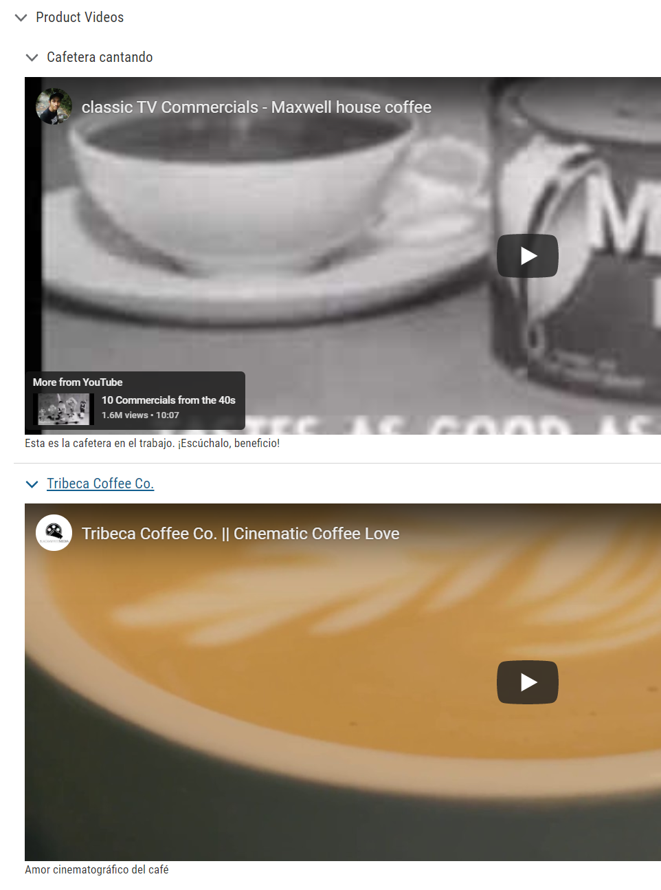

---

## Documentation

Read [this document](docs/B2B+LE+Video+Player+Admin+Documentation.pdf) for external documentation on the component.

## FAQs

#### Does it work in Communities?

> Yes

#### Does it work in Mobile?

> Yes

#### Does it work with Person Accounts?

> No

#### Others?

## [Contributing](/CONTRIBUTING.md)

See the list of [Contributors][contributors-url] who participated in this project.

If you would like to join these awesome people, please refer to [contributing.md](/CONTRIBUTING.md) for guidelines.

## History ##

- 1.1.0
	* Initial release of managed package

## Acknowledgements

Special thanks to:

- Anand Subbiah
- Steve Ecker
- Brooks Haines
- Jason Illg

## License

[![License][license-shield]][license-url] Copyright © 2021 [Q Branch][author-url]

<!--- Images -->

[license-shield]: https://img.shields.io/badge/License-BSD%203--Clause-blue.svg

<!--- Urls -->

[repository-url]: https://github.com/sfdc-qbranch/DemoComponentTemplate
[license-url]: http://opensource.org/licenses/BSD-3-Clause
[author-url]: http://github.com/paull10au
[contributors-url]: https://github.com/sfdc-qbranch/DemoComponentTemplate/contributors
[quip-url]: https://salesforce.quip.com/um8sAuXNyCnO
